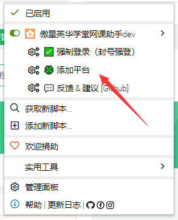
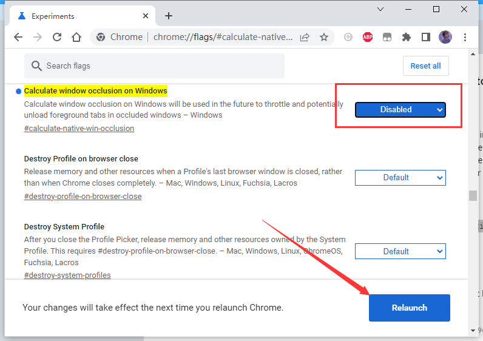

## 英华网课助手
推荐使用新出炉的`英华学堂网课助手客户端版本`  
更快、更稳、更强 😁  
<https://github.com/aoaostar/mooc/releases/latest>

## 声明
本项目基于`GPL-3.0`，完全开源，免费，仅供技术学习和交流，开发者并未授权任何组织、机构以及个人将其用于商业或者盈利性质的活动。也从未使用本项目进行任何盈利性活动。未来也不会将其用于开展营利性业务。个人或者组织，机构如果使用本项目产生的各类纠纷，法律问题，均由其本人承担。
如果您开始使用本项目，即视为同意项目免责声明中的一切条款，条款更新不再另行通知。

## 功能
* 自动播放 🔥
* 看完自动跳转下一课 🔥
* 自动识别验证码 🔥
* 封号强登 🔥
* 自定义添加平台 🔥
* 省流模式 🔥
* 无需播放视频亦可提交播放时长 ✨
* 全自动挂机
* 自动发送模拟鼠标记录
* 去除多标签刷课的限制
* 去除无法拉进度条的限制
* 刷完提醒
* 等等

## 安装
* 安装最新版本的`Chrome`或者`Edge(chromium)`
  * 油猴
    - 安装最新版本的`Tamper Monkey`
      - <https://www.tampermonkey.net/>
    - 安装最新版本的脚本
      - <https://greasyfork.org/zh-CN/scripts/439148>
    - 油猴理应自动弹出
    - 如果油猴未弹出，在油猴中新建脚本，并复制粘贴保存
      - <https://github.com/aoaostar/cdn/blob/master/yinghuaonline/script.js>

  * 暴力猴
    * 未测试

## 使用
  * 在`Tamper Monkey`管理面板中启用该脚本
  * 打开网课播放页面
  * 添加平台
    - 由于2022年2月底英华更新了，每个学校都用自己的域名了，而不是英华的域名
    - 点击油猴
    - 添加平台  
      
  * 鼠标移动到最左边将显示脚本面板
  * 下图所示为成功示意图
  * 

> PS：新版本自动屏蔽`/static/user/js/video.js`文件，无需手动屏蔽  
> 首次使用，为了保证脚本正常运行，请强制刷新缓存（`ctrl` + `f5`）  
> 强烈建议阅读`常见问题`后再使用该脚本！

### 封号强登

### 视频教程
  
  [教程视频.mp4](images/教程视频.mp4)

<video controls="controls"  preload="auto">
      <source src="images/教程视频.mp4" type="video/mp4">
</video>

## 常见问题
* 为什么脚本没有反应？
  - 用的是最新版的`Chrome 浏览器`吗？
  - 用的是最新版的`tamper monkey`吗？
  - 重启浏览器试试
  - 重装脚本试试
  - 是否在油猴中开启了脚本？
* 封号强登是什么意思？
  - 假如你的账号被封了，无法正常登录，使用该功能可以强行登录账号
* 省流模式是什么意思？
  - 省流模式不会播放视频，可以降低网速占用和能耗
  - 脚本原理不依赖视频的播放，可以放心使用
* 浏览器挂后台怎么不刷了？
  - 2021年12月`Chromium Blog`发表了一篇文章
  - > Chrome on Windows performance improvements and the journey of Native Window Occlusion
  - https://blog.chromium.org/2021/12/chrome-windows-performance-improvements-native-window-occlusion.html
  - 总的来说就是 `Chrome` 会暂停或冻结非活动标签（包括你把`Chrome`最小化到了后台）以节省系统资源，这可能会导致使用者的闲置游戏等意外暂停。一般来说，可通过将选项卡拉到自己的窗口中来解决这个问题。
  - 也有一劳永逸的方法：
    - 将其复制并粘贴到你的`URL`栏中：`chrome://flags/#calculate-native-win-occlusion`
    - 将下拉菜单从`Default`更改为`Disabled`
    - 单击右下角的按钮以重新启动 `Chrome`
    - 
  - > `edge`内核和`Chrome`一样同为`Chromium`, 原因一致

## 其它
  * 用爱发电，佛系更新
  * 本项目基于`JavaScript`, 很欢迎感兴趣的同学一起来开发
  * 觉得不错的可以给个`star`~
  * 有问题请提`issue`

## 支持的学校
  * https://mooc.yinghuaonline.com/school  
  * https://shixun.kaikangxinxi.com/school  
  * 等等相同系统的平台
