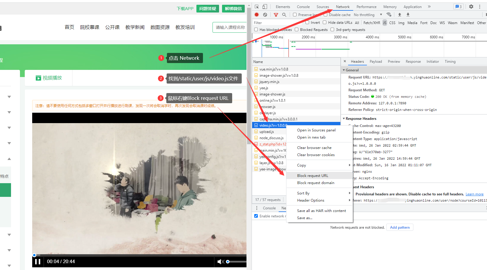
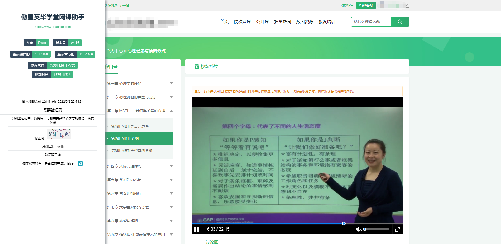

## 英华网课助手
## 声明
本项目基于GPL-3.0，完全开源，免费，仅供技术学习和交流，开发者并未授权任何组织、机构以及个人将其用于商业或者盈利性质的活动。也从未使用本项目进行任何盈利性活动。未来也不会将其用于开展营利性业务。个人或者组织，机构如果使用本项目产生的各类纠纷，法律问题，均由其本人承担。
如果您开始使用本项目，即视为同意项目免责声明中的一切条款，条款更新不再另行通知。

## 安装
* 安装最新版本的Chrome或者Edge(chromium)
* 油猴
  - 安装最新版本的Tamper Monkey
    - <https://www.tampermonkey.net/>
  - 安装最新版本的脚本
    - <https://greasyfork.org/zh-CN/scripts/439148>
  - 油猴理应自动弹出
  - 如果油猴未弹出，在油猴中新建脚本，并复制粘贴保存
    - <https://github.com/aoaostar/cdn/blob/master/yinghuaonline/script.js>
## 使用
  * 在Tamper Monkey管理面板中启用该脚本
  * 打开网课播放页面
  * 打开控制台，`F12`或者鼠标右键`检查`
  * 屏蔽`/static/user/js/video.js`文件
    * 
  * 刷新页面
  * 页面如下图所示即为成功
  * 
## 功能
  * 自动播放
  * 看完自动跳转下一课
  * 自动识别验证码
  * 全自动挂机
  * 自动发送模拟鼠标记录
  * 去除多标签刷课的限制
  * 去除无法拉进度条的限制
  * 等等

## 常见问题
* 为什么脚本没有反应？
  - 用的是最新版的Chrome浏览器吗？
  - 用的是最新版的tamper monkey吗？
  - 重启浏览器试试
  - 重装脚本试试
  - 是否在油猴中开启了脚本？

## 其它
  * 用爱发电，佛系更新
  * 本项目基于`JavaScript`, 很欢迎感兴趣的同学一起来开发
  * 觉得不错的可以给个`star`~