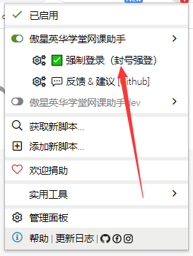

## 英华网课助手
## 声明
本项目基于`GPL-3.0`，完全开源，免费，仅供技术学习和交流，开发者并未授权任何组织、机构以及个人将其用于商业或者盈利性质的活动。也从未使用本项目进行任何盈利性活动。未来也不会将其用于开展营利性业务。个人或者组织，机构如果使用本项目产生的各类纠纷，法律问题，均由其本人承担。
如果您开始使用本项目，即视为同意项目免责声明中的一切条款，条款更新不再另行通知。

## 安装
* 安装最新版本的`Chrome`或者`Edge(chromium)`
  * 油猴
    - 安装最新版本的`Tamper Monkey`
      - <https://www.tampermonkey.net/>
    - 安装最新版本的脚本
      - <https://greasyfork.org/zh-CN/scripts/439148>
    - 油猴理应自动弹出
    - 如果油猴未弹出，在油猴中新建脚本，并复制粘贴保存
      - <https://github.com/aoaostar/cdn/blob/master/yinghuaonline/script.js>
    - 补充脚本运行域名  
      - 由于2022年2月底英华更新了，每个学校都用自己的域名了，而不是英华的域名  
      - 目前已经添加了一些学校，如果缺失了你的学校，请自行添加自己学校网课的网址    
        首先点击编辑脚本代码，在`// ==UserScript==`和`// ==/UserScript==`中间添加一行  
        `*`表示匹配任意字符  
        ```
        // @match *://你学校平台的域名/*
        ```
        例如：`http://xxx.com/abc`  
        ```
        // @match *://xxx.com/*
        ```
  * 暴力猴
    * 未测试
        


## 使用
  * 在`Tamper Monkey`管理面板中启用该脚本
  * 打开网课播放页面
  * 鼠标移动到最左边将显示脚本面板
  * 下图所示为成功示意图
  


> PS：新版本自动屏蔽`/static/user/js/video.js`文件，无需手动屏蔽  

### 封号强登
  
* 目前已支持学校专属平台登录，如果学校专属平台无法登录请使用下方地址登录：
  * 慕课平台：https://mooc.yinghuaonline.com/user/login
  * 实训平台：https://shixun.kaikangxinxi.com/user/login




### 视频教程（旧）
  
  [教程视频.mp4](images/教程视频.mp4)

<video controls="controls"  preload="auto">
      <source src="images/教程视频.mp4" type="video/mp4">
</video>

## 功能
  * 自动播放
  * 看完自动跳转下一课
  * 自动识别验证码
  * 全自动挂机
  * 自动发送模拟鼠标记录
  * 去除多标签刷课的限制
  * 去除无法拉进度条的限制
  * 封号强登
  * 等等

## 常见问题
* 为什么脚本没有反应？
  - 用的是最新版的`Chrome浏览器`吗？
  - 用的是最新版的`tamper monkey`吗？
  - 重启浏览器试试
  - 重装脚本试试
  - 是否在油猴中开启了脚本？

## 其它
  * 用爱发电，佛系更新
  * 本项目基于`JavaScript`, 很欢迎感兴趣的同学一起来开发
  * 觉得不错的可以给个`star`~
  * 有问题请提`issue`

## 支持的学校
  * https://mooc.yinghuaonline.com/school  
  * https://shixun.kaikangxinxi.com/school  
    * 生成`include代码`
    ```js
    let a = '';
    document.querySelectorAll('body > div.wrapper > div.sinoPaddingCenter > div > div.nschool > div > div > div.box > div.link > a').forEach(v =>{
    a += '// @match '+v.getAttribute('href').replace('https://','*://')+'/*\n'
    })
    console.log(a)
    ```